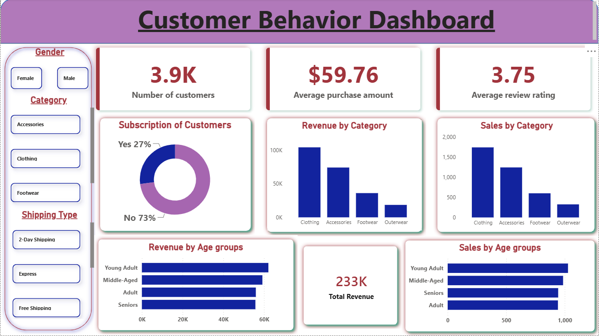

# Customer Behavior Dashboard

## About the Project

This project is an interactive Power BI dashboard created to analyze customer shopping behavior. The main goal was to understand customer purchasing patterns, product performance, subscription trends, and overall sales using visualizations.

This project was built to strengthen my data analytics skills by combining PostgreSQL, Python, and Power BI to analyze customer shopping behavior and create an interactive business dashboard.

---

## Dashboard Preview



---

## Project Objectives

- Analyze customer purchasing behavior.
- Compare sales across different product categories.
- Understand customer demographics.
- Explore subscription patterns.
- Build an interactive dashboard for better business insights.

---

## Tools Used

- Power BI
- Python (Pandas,Jupyter Notebook)
- Microsoft Excel

---

## Dataset

The dataset contains customer shopping records, including:

- Customer demographics
- Product category
- Purchase amount
- Subscription status
- Customer ratings
- Payment methods

---

## Dashboard Features

The dashboard includes:

- Customer overview
- Revenue analysis
- Sales by category
- Subscription analysis
- Customer ratings
- Interactive slicers for filtering data

---

## Key Insights

- Identified top-performing product categories based on revenue.
- Analyzed customer purchasing behavior across different demographics.
- Compared subscription and non-subscription purchase patterns.
- Built an interactive dashboard for business decision-making.

## Repository Structure

```
Customer-behavior-dashboard
│
├── Dataset
├── PowerBI
├── Python
├── customer_analysis_report.pdf
├── dashboard.png
└── README.md
```

---

## What I Learned

While working on this project, I learned how to:

- Clean and explore data using Python (Pandas).
- Import and query data using PostgreSQL.
- Create interactive dashboards in Power BI.
- Design meaningful charts and KPIs.
- Present insights in a simple and understandable way.
- Organize a project for GitHub.

---

## Future Improvements

- Add more business KPIs.
- Connect the dashboard to a live database.
- Include additional customer segmentation analysis.

---

## Author

**Aaditya Kumar Singh**

If you have any suggestions or feedback, feel free to connect with me on GitHub.
